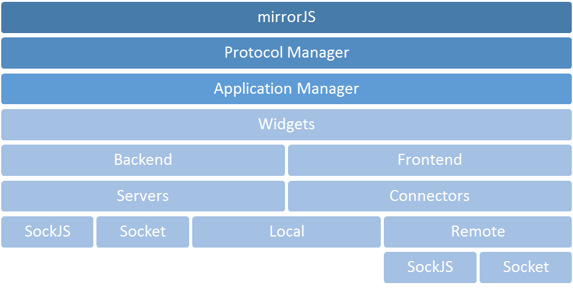
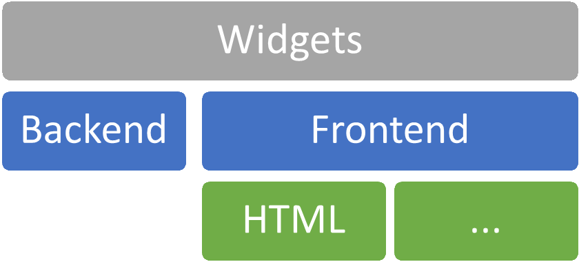

# mirrorJS Widgets

## mirrorJS's hierarchical structure


---

## mirrorJS widget's hierarchical structure


---

# Code
## Sample Local application
```javascript
function main(app, args /* CUSTOM ARGUMENTS */)
{
	var myContainer = app.create("container");
	myContainer.setParent( args["my_cnt"] );

	var myTxt = app.create("textfield", myContainer);
	myTxt.Text = "This is a Textfield";

	var myButton = app.create("button", myContainer);
	myButton.Caption = "Caption";
	myButton.Width = 123;
	myButton.Height = 22;
	myButton.on("click", function()
		{
			myTxt.Text = "Click!";
		});

	var myTabber = app.create("tabber", myContainer);
	var myTab1 = app.create("tab", myTabber);
	myTab1.Caption = "Tab 1";
	
	var myTab2 = app.create("tab", myTabber);
	myTab2.Caption = "Tab 2";

	var myButton2 = app.create("button", myTab1);
	myButton2.Caption = "Btn in tab1";
	myButton2.on("click", function()
		{
			/* ... */
		});
}

/* mirrorJS.app.local( <UI local connector>( <frontend>, <channel> ), <callback>, <conf> ); */
var myApp = new mirrorJS.app.local(
				new mirrorJS.ui.connectors.local( "html" /*, loopback */ ),
				main,
				{
					/* CONF */
					"widgets":
						{
							"prefixID" : "mjd_"
						},
					"args":
						{
							/* CUSTOM ARGS */
						},
					"events":
						{
							"onClose": function(app)
							{
								/* ... */
							}
						}
				});
```

---

## Sample Remote application
```javascript
var conf = {
			host: "127.0.0.1",
			port: 9999
	};
/* mirrorJS.app.remote( <UI local connector>( <frontend>, <channel> ), <alias> ); */
var myApp = new mirrorJS.app.remote(
		new mirrorJS.ui.connectors.local( "html",
										  new mirrorJS.connectors.SockJS(conf)),
		"designer" );

```

---

## Sample SockJS Application server
```javascript
var mirrorJS = require("../mirrorjs-0.0.1.min");
global.__base_path = __dirname + "/";
mirrorJS.widgets.controller.installAll();
var myAppServer = new mirrorJS.servers.SockJS(
                        mirrorJS.servers.readConf(global.__base_path + "mirror.conf", true) );
```

---

## Sample widget
```javascript
{
    "name": "button",
    "html": function(ui, handle, parent, args)
        {
            var that = this;
            mirrorJS.widgets.base.ui.call(this, ui, handle, parent, args);
            this.show = function()
            {
                this.node_cnt$.append(
                    '<button id="btn_' + this.handle + '" type="button"></button>'
                );
                this.node$ = $("#btn_" + this.handle, this.node_cnt$);
                this.node$.click( function(event)
                {
                    ui.events.fire(handle, "click");
                    event.stopPropagation();
                } );
            };
            this.props = {
                "Caption": function(v)
                    {
                        that.node$.text( v );
                    }
				/* ,... */
                };
        },
    "backend": function(iApp, handle, parent, args)
        {
            var that = this;
            // Properties
            var _caption = '';
            this.props =
                {
                    "Caption":
                        {
                            "get": function()
                                {
                                    return _caption;
                                },
                            "set": function(nv)
                                {
                                    _caption = nv;
                                    return nv;
                                }
                        }
						/* , ... */
                };
            // Inherit base control
            mirrorJS.widgets.base.backend.call(this, iApp, handle, parent, args);
        }
};
```

# Live Demo

MirrorJS Sample Application Designer: http://www.mirrorjs.com/designer/
